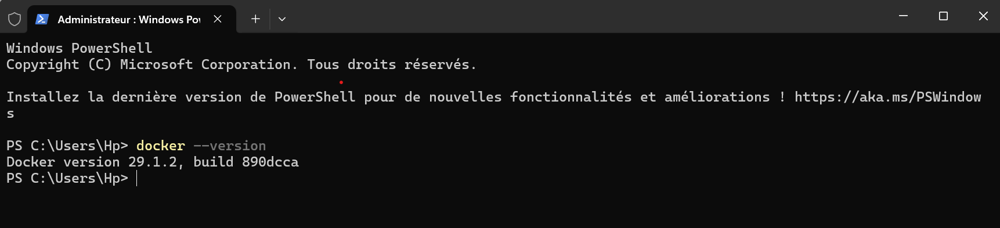
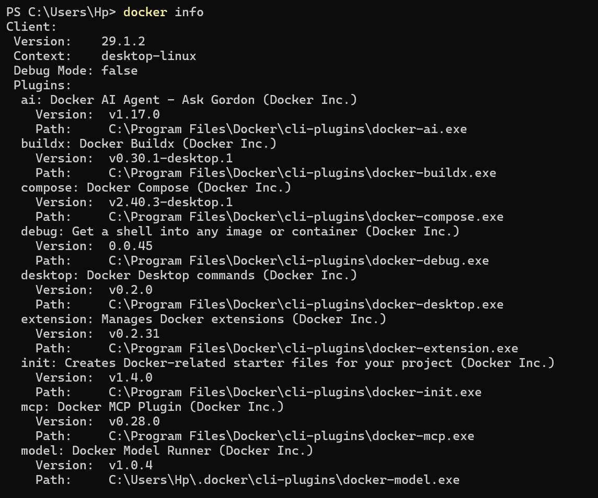
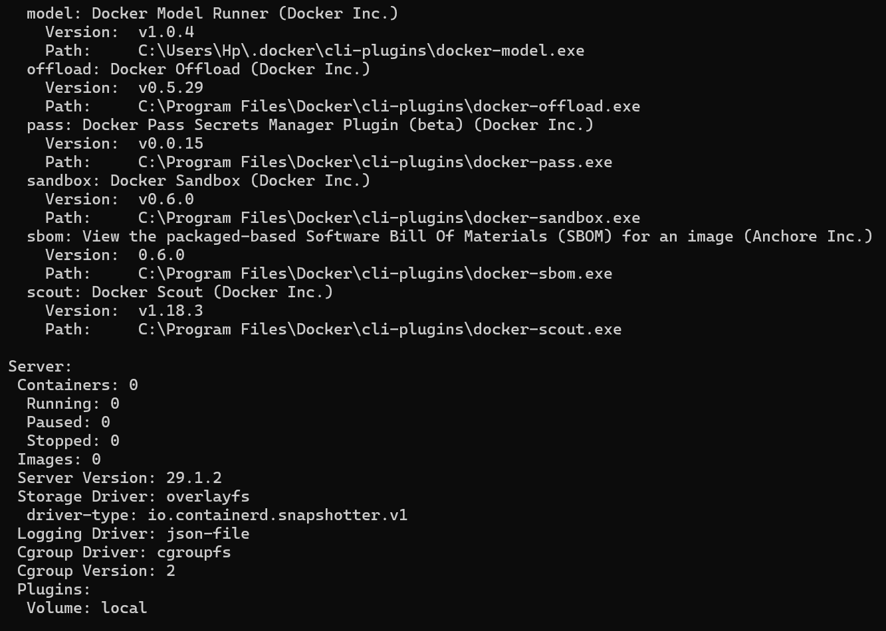
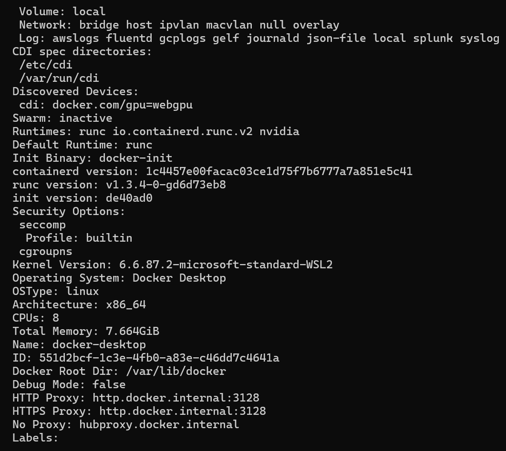
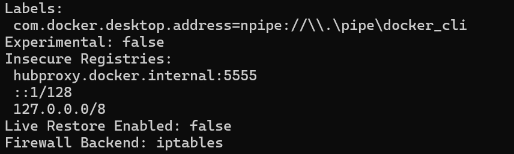
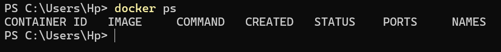
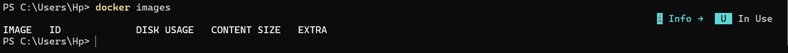
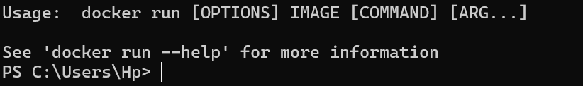
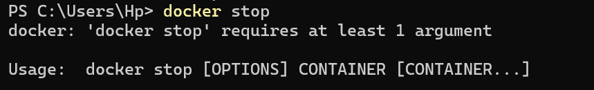
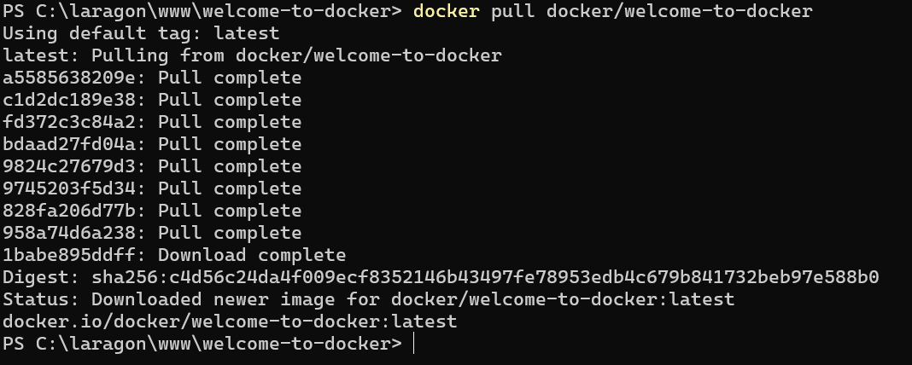
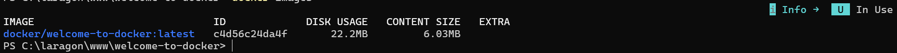
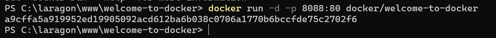
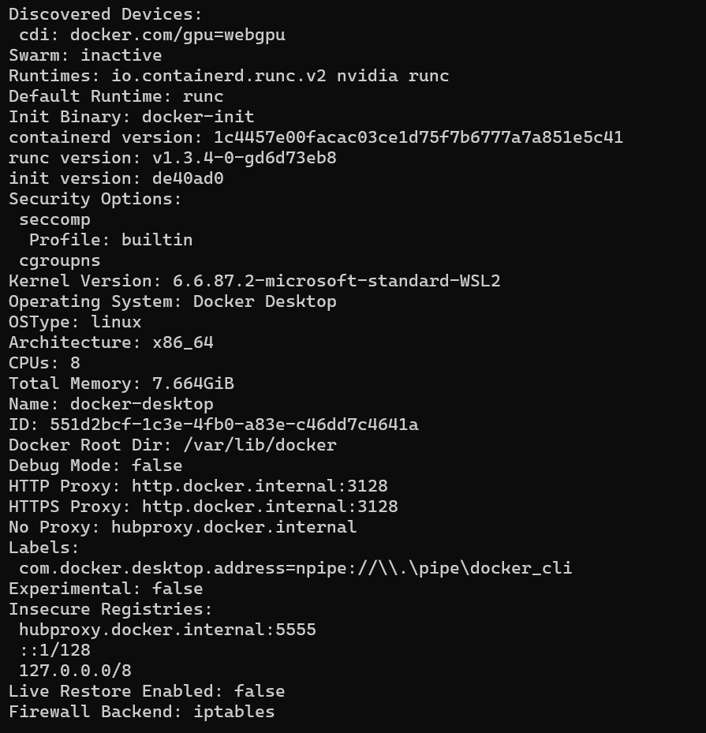
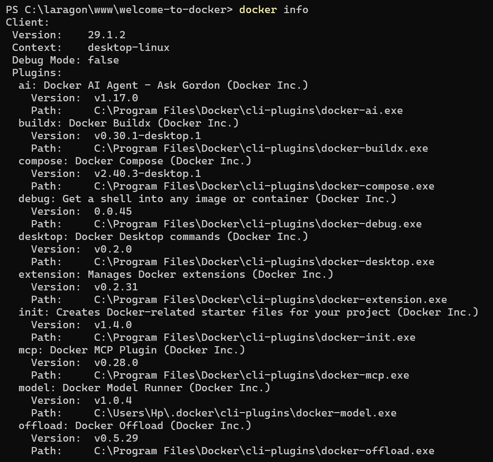
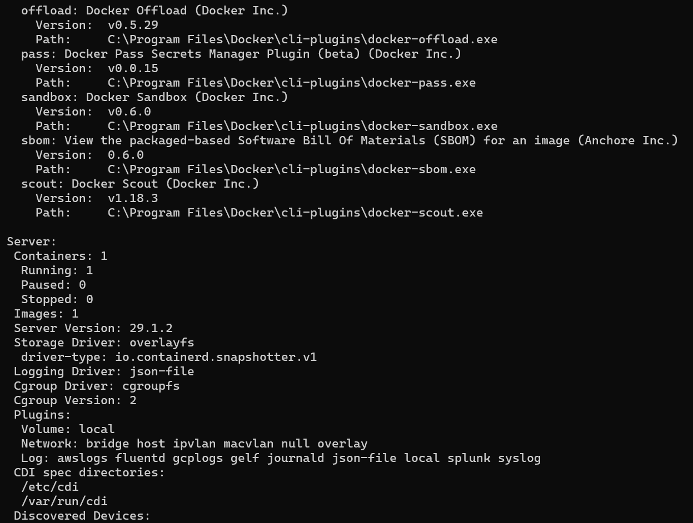
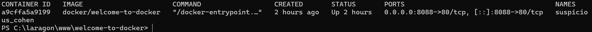
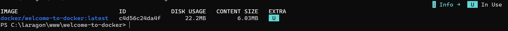
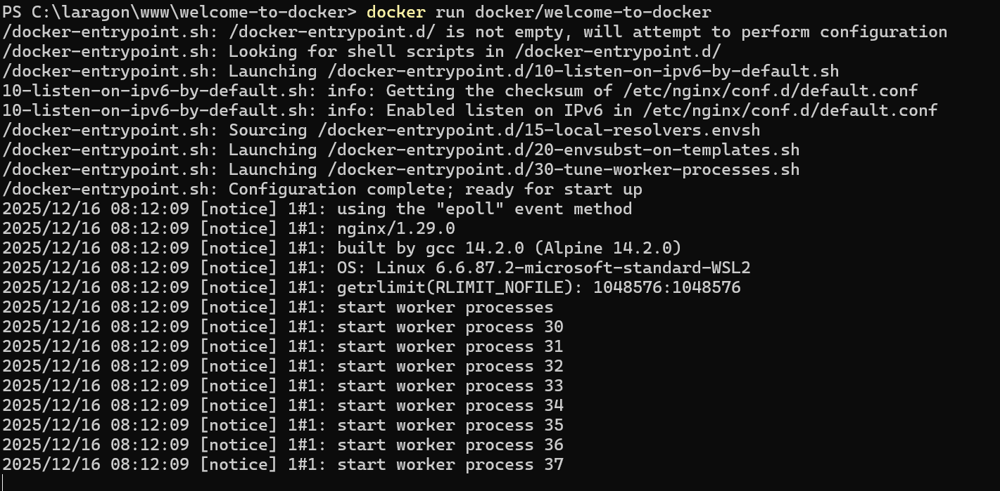
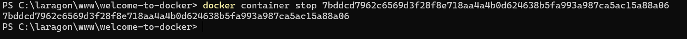
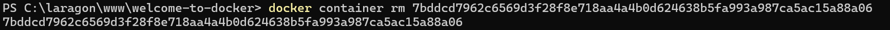
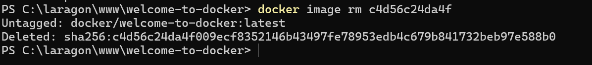
Exemple de commandes pour supprimer :
○ Un conteneur spécifique -> docker container rm d773471c9cfde662389e1c148b220683090172cfd251748b630d1d278711260b
○ Plusieurs conteneurs
○ Tous les conteneurs arrêtés -> docker container prune
○ Forcer la suppression d'un conteneur actif -> docker rm --force 03f28aa7b3db914f474dc885cb4d7763736a0d80dbaed571a50d954486866bde
○ Une image spécifique -> docker image rm c4d56c24da4f
○ Plusieurs images
○ Toutes les images inutilisées -> docker image prune
○ Toutes les images non utilisées
○ Forcer la suppression d'une image
○ Quel erreur est présente dans les commandes données
ci-dessus, donner la correction
