**● Utiliser docker par le terminal de visual studio :**

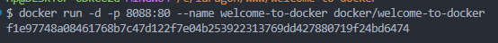

**● Positionnez-vous dans le dossier du projet «welcome-to-docker » :**

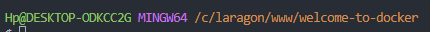

**● Consulter les fichiers présent comme Dockerfile :**

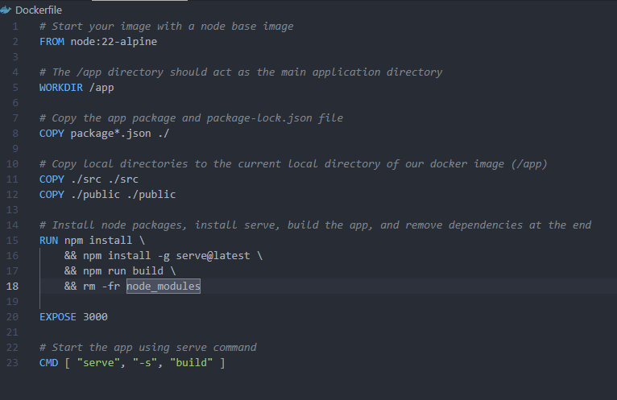

**● Analysez les et comprenez ce qu’il font :**

→ Le Dockerfile permet d'initialiser les base d'un projet prêt à être conteneurisé

**● Consulter le fichier README.md :**

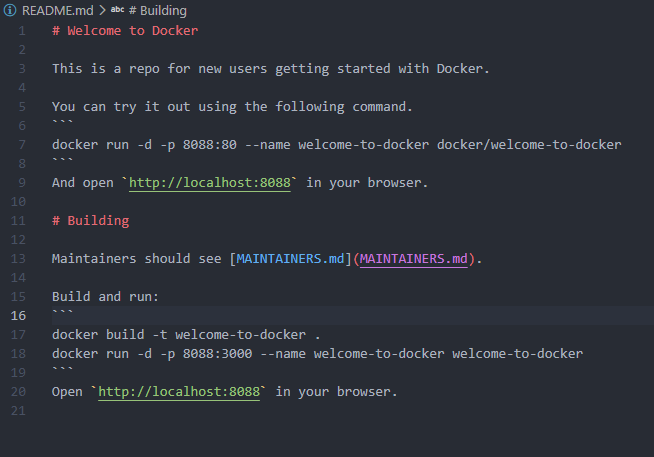

**● Créer l’image docker à partir de ce projet de sorte que le fichier dockerfile soit pris en compte :**

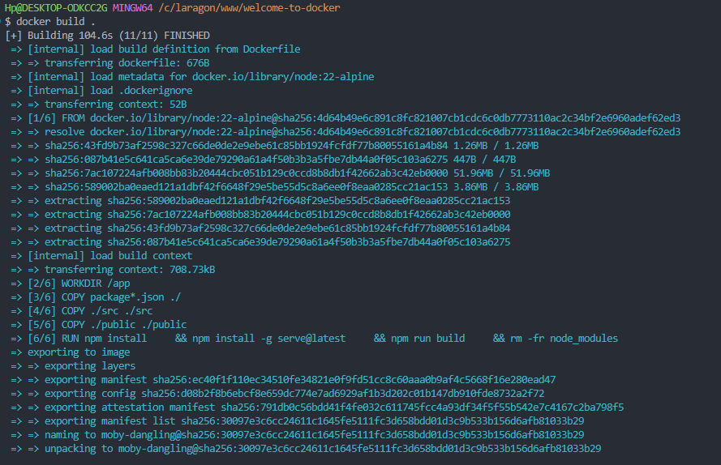

**● Lancer l’image docker que vous venez de créer et lancer un container avec :**

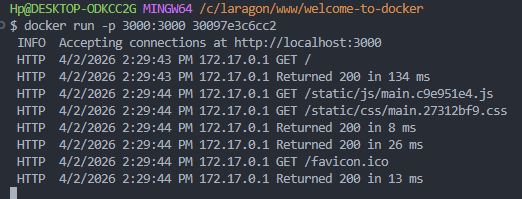

**● Vérifiez s’il est lancé et d’autres commandes de bases que vous avez faites dans le premier exercice :**

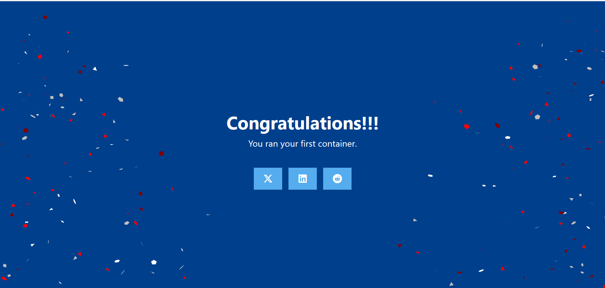

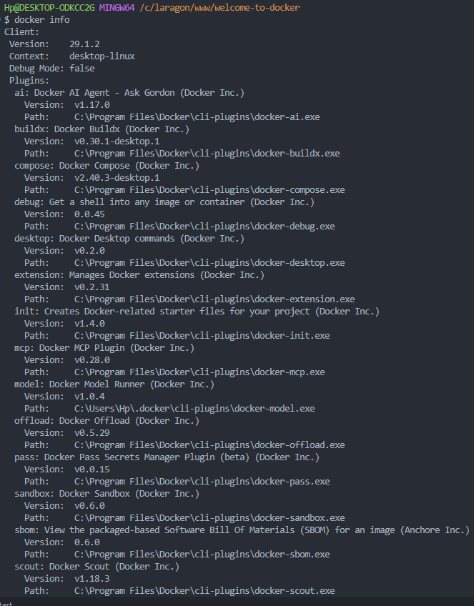

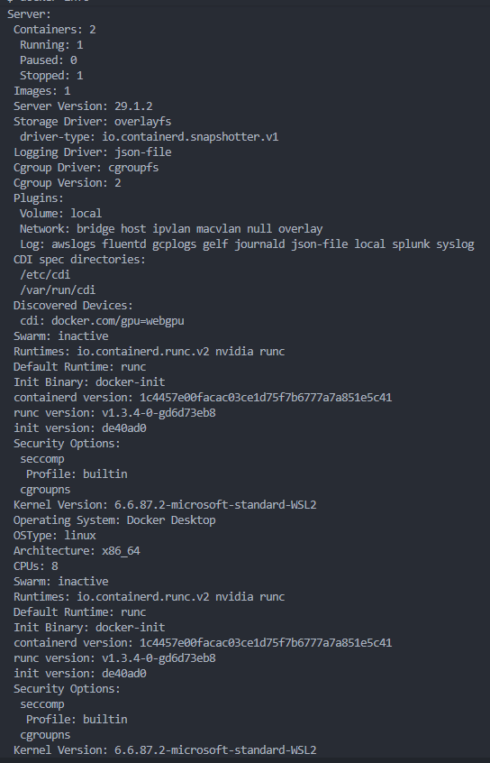

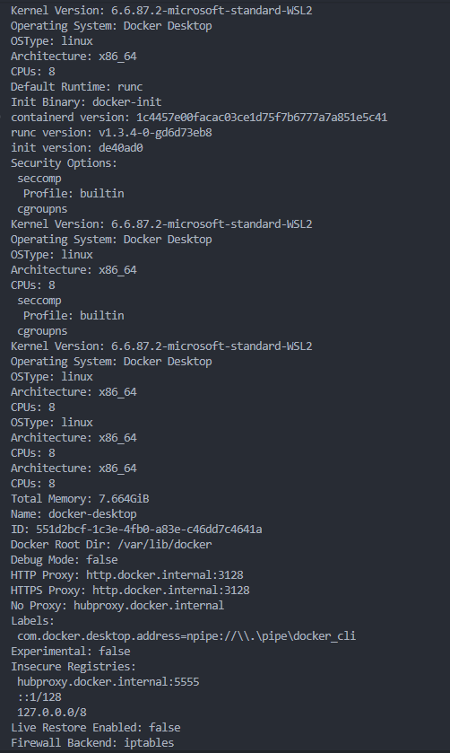

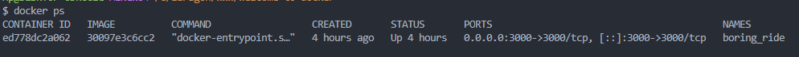

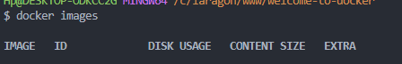

**● Accéder au container pour visualiser le résultat :**

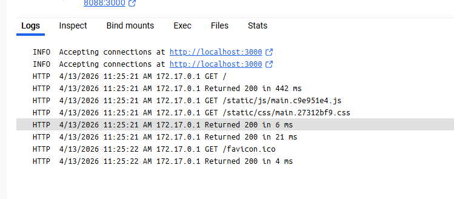

**● Retournez dans Visual Studio et coder quelques lignes dans votre projet :**

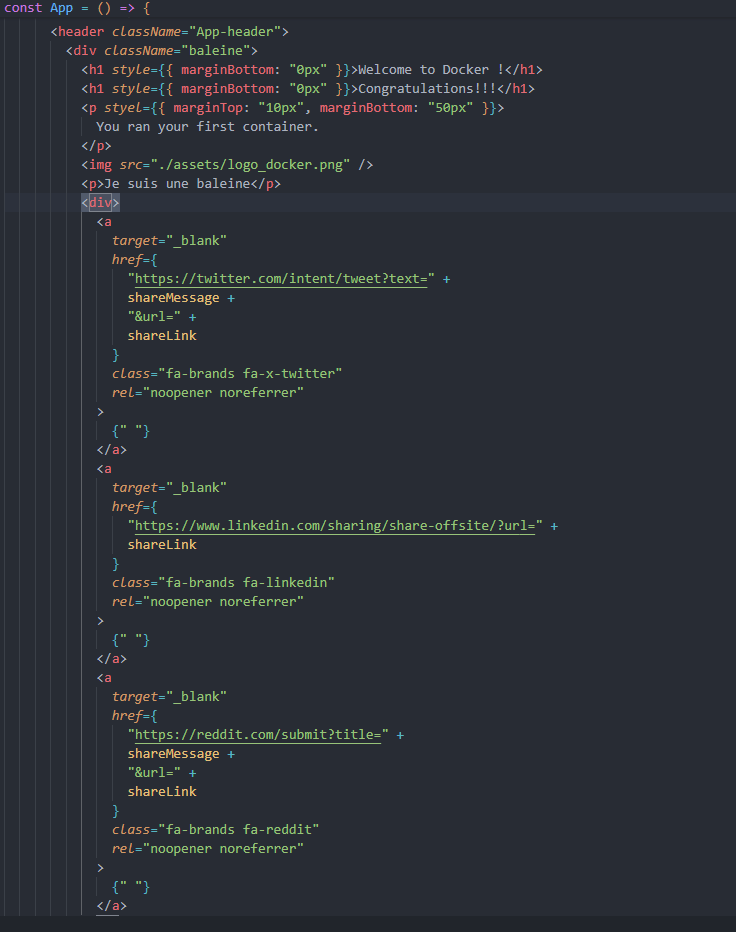

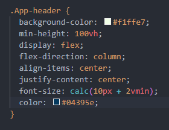

**● Vérifiez le résultat faites en sorte que vos modifications soient prises en compte dans votre image docker et votre container :**

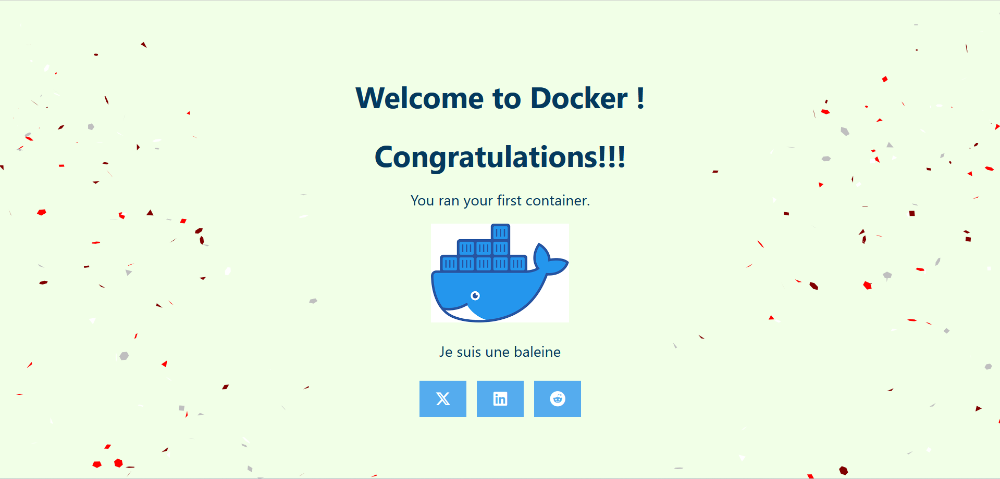

**● Comprenez ce qu’il faut faire pour que ce soit pris en compte :**

→ pour que les changements soient pris en compte il faut faire une build avec l'image Docker

**● Publier sur votre compte docker une image docker, et rendez la disponible à un membre de votre promo**

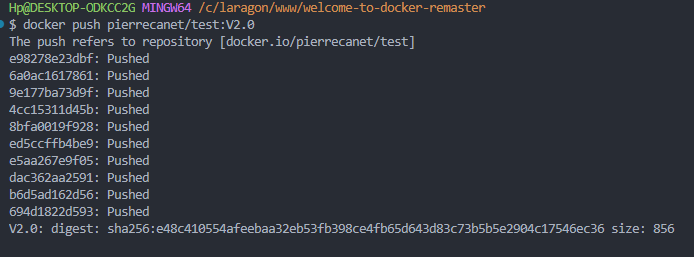

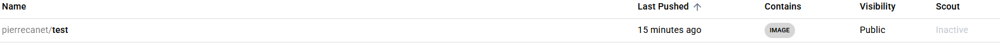

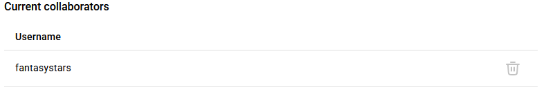
