# Docker jour 01 job 03

**● Ouvrir docker-desktop :**

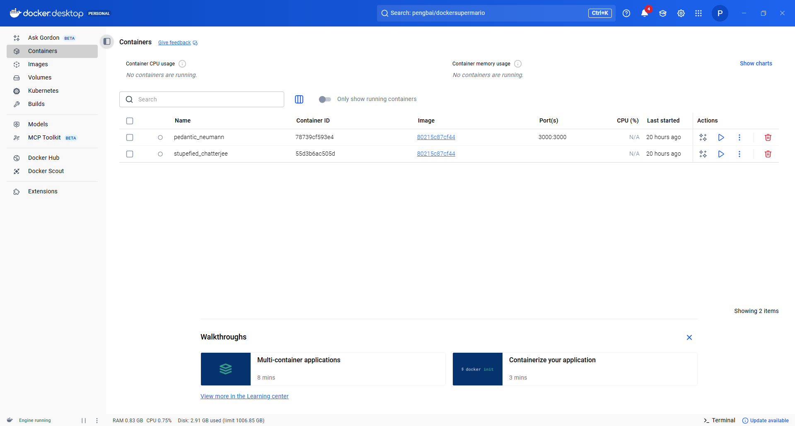

**● Placez vous sur le menu à gauche dans “images” :**

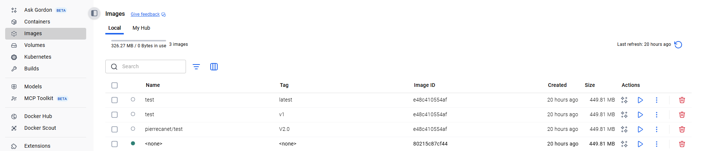

**● Trouver le terminal dans Docker Desktop :**

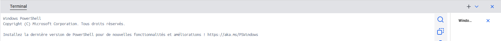

**● Chercher l’image docker cité ci-dessus par une commande dans ce dernier :**

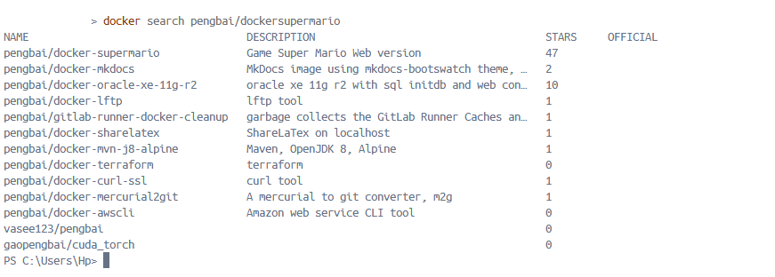

**● Récupérer l’image Docker dans “Docker-Desktop” :**

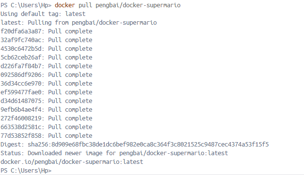

**● Observer quand vous avez validé votre commande ce qui c’est passé dans votre fenêtre au dessus :**

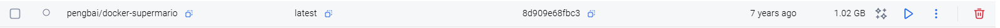

**● PLacez vous sur le menu gauche sur container :**

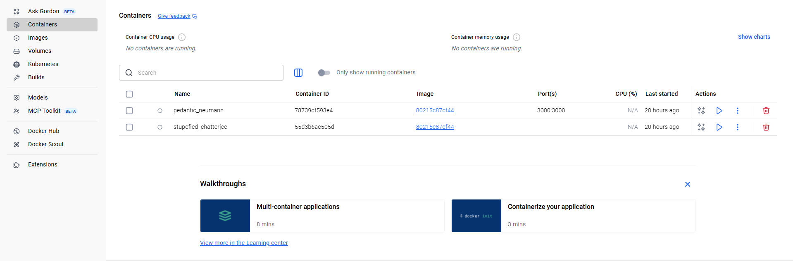

**- Lancer un container avec cette image et assignez lui le port 8600 en considérant que l’image est configuré sur le port 8080 et en conservant l'accès à l’invite de commande :**

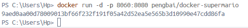

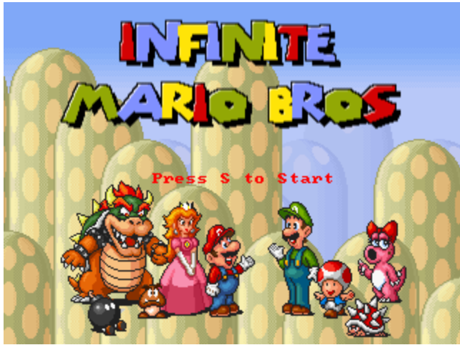

**- Trouvez les deux méthodes avec des ports différents de le faire (invite de commande et ???) :**

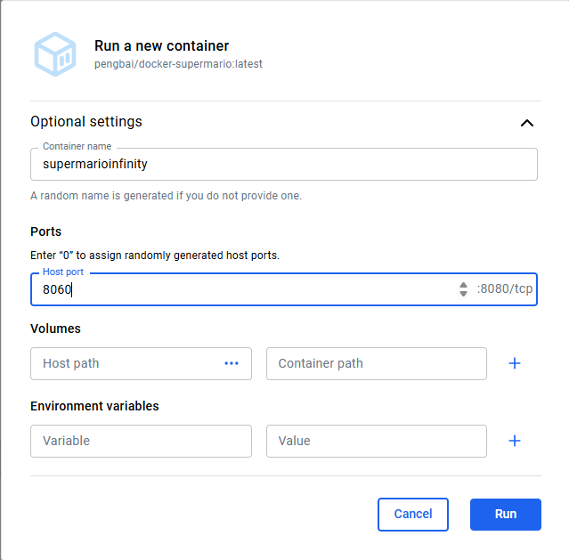

**● observer quand vous avez validé votre commande ce qui c’est passé dans votre fenêtre au dessus :**

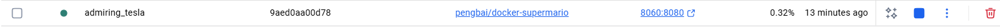

**● Lancer une autre image de super mario sur un port différent :**

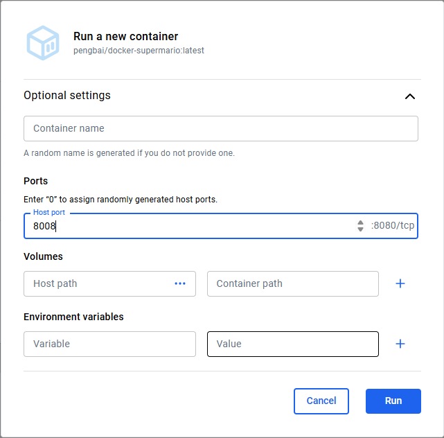

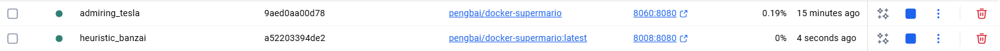

**● Ouvrir votre explorateur et trouver le moyen d’accéder au container construit :**

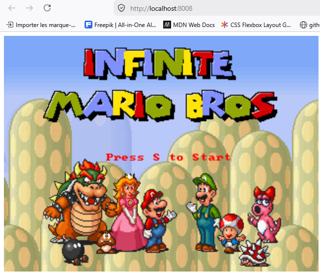

**● Accéder et jouer un peu dans votre explorateur internet (faites des captures du jeux en cours “3 au moins”) :**

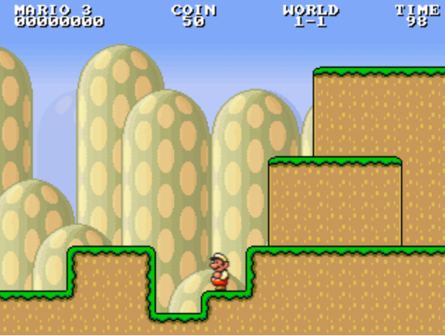

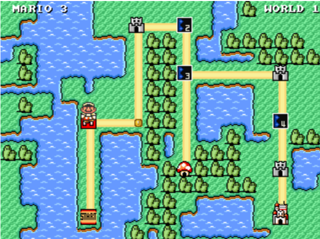

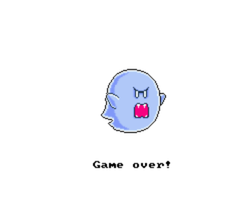

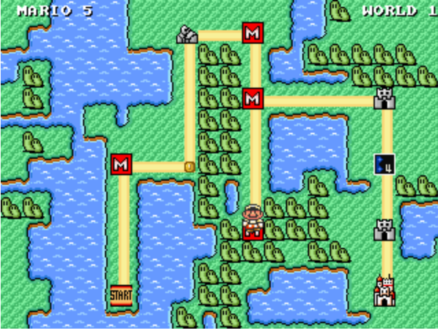

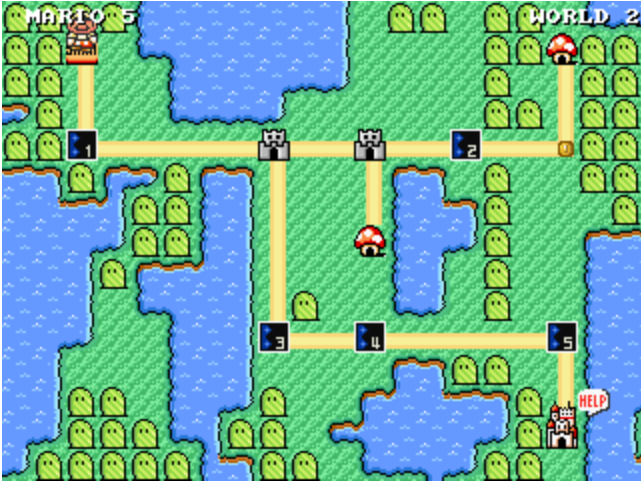

**● retourner dans le terminal de docker desktop :**

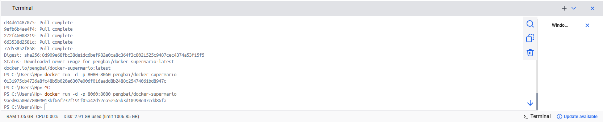

**● Arrêter votre container par son ID (2 manière de trouver l’ID) :**

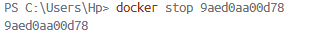

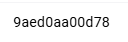

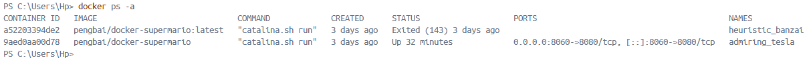

**● observer quand vous avez validé votre commande ce qui c’est passé dans votre fenêtre au dessus :**

**● Supprimer le container (2 manières) :**

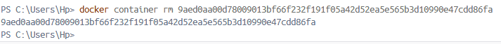

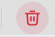

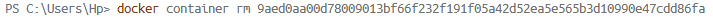

**● observer quand vous avez validé votre commande ce qui c’est passé dans votre fenêtre au dessus :**

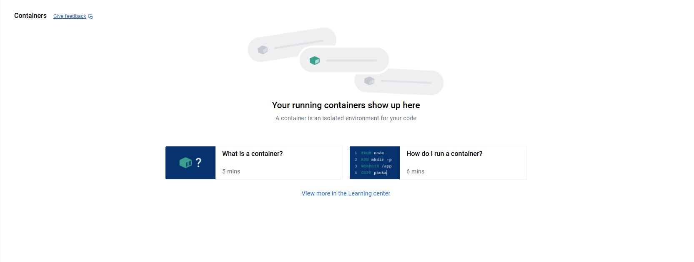

**● Placez vous sur le menu à gauche dans images :**

**● supprimer l’image docker de super mario (2 manières) :**

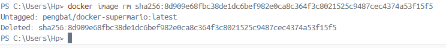

**● observer quand vous avez validé votre commande ce qui c’est passé dans votre fenêtre au dessus :**

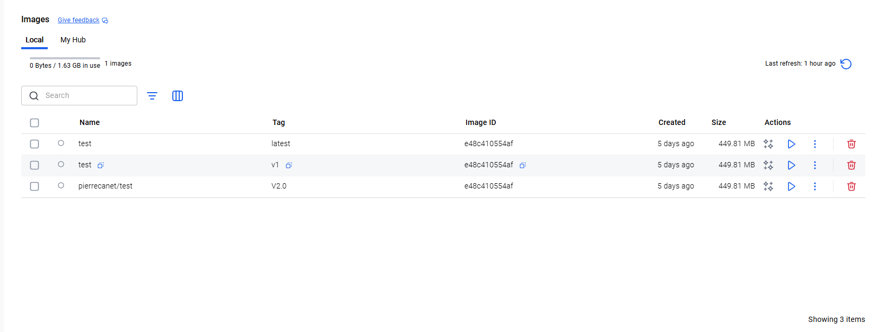
