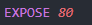
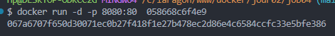
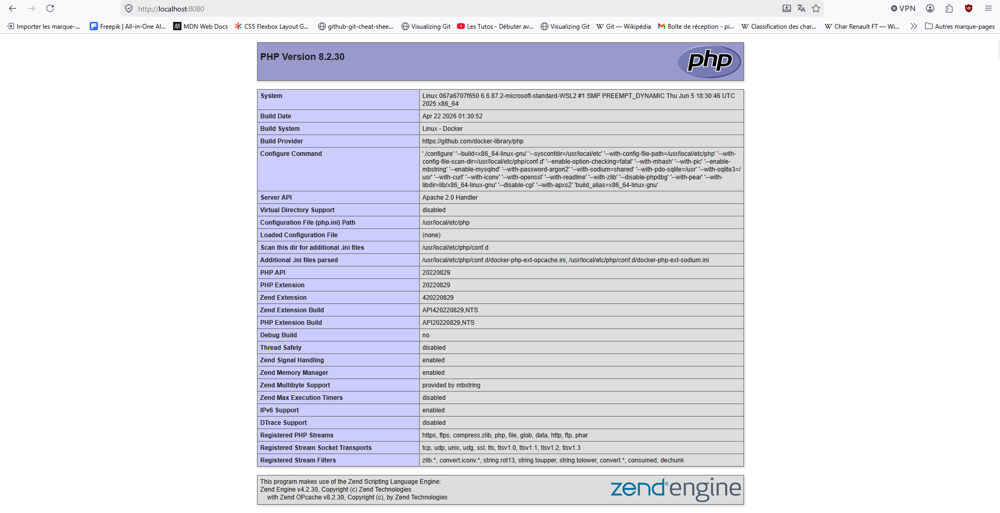
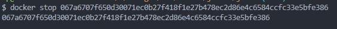

# Docker jour 02 job 04

**● créer un fichier index.php affichant les info sur le serveur apache (trouver la commande php pour cela, il n'y aura que la balise php et une commande qui en fait que 10 caractères dans le fichier) :**

-se référer au fichier index.php

**● créer un dockerfile qui générera un environnement pour afficher cette page :**

-se référer au Dockerfile

**● Application sur le port 80 :**

**● exposer sur le port 8080 :**

**● créer l’image :**

**● créer le container :**

**● faite le tourner :**

**● stoppez le :**

